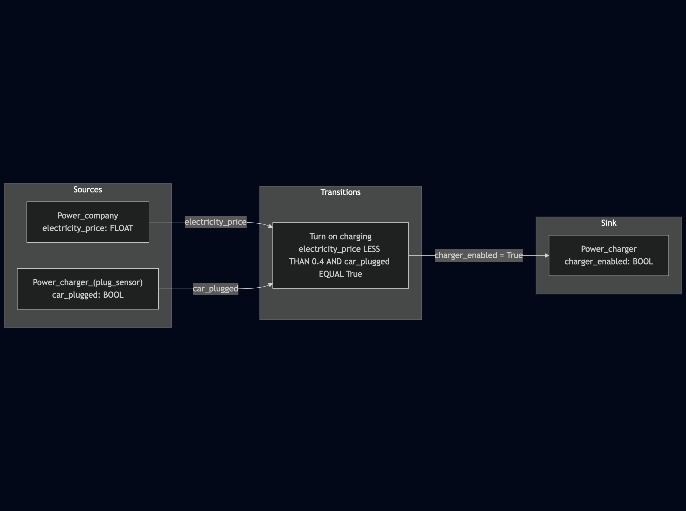

# LLM TAP (Trigger-Action Programs)

`llm-tap` is a lightweight and extensible library to generate workflows using Large Language Models (LLMs). `llm-tap` provides mechanisms and data structures to generate workflows and constraints for any existing workflow engine.

`llm-tap` is *not* a workflow library but should be used to design a workflow generator with LLMs.

## Quickstart

Let's take an example to generate a workflow based on the following user query:

> *When the electricity price is below $0.4/ kWh and my Tesla is plugged, turn on charging.*

To generate a workflow, `llm-tap` uses Colored Petri Nets to describe the different components.


```python
from llm_tap import llm
from llm_tap.models import (
    SOURCE,
    SINK,
    Workflow,
    Place,
    TokenType,
    instructions,
    register_place,
    register_token_type,
    get_places,
)

remaining_range = TokenType(name="remaining_range", type="INT")
charger_enabled = TokenType(name="charger_enabled", type="BOOL")
car_plugged = TokenType(name="car_plugged", type="BOOL")
electricity_price = TokenType(name="electricity_price", type="FLOAT")


register_token_type(remaining_range)
register_token_type(charger_enabled)
register_token_type(car_plugged)
register_token_type(electricity_price)

register_place(
    Place(
        name="Power company",
        description="Provides current electricity price",
        type=SOURCE,
        token_type=electricity_price,
    )
)

register_place(
    Place(
        name="Power charger (plug sensor)",
        description="Provides the status of the plug",
        type=SOURCE,
        token_type=car_plugged,
    )
)

register_place(
    Place(
        name="Power charger",
        description="Charge electric vehicles",
        type=SINK,
        token_type=charger_enabled,
    )
)

register_place(
    Place(
        name="EV monitoring system (range)",
        description="Provides the remaining range in miles",
        type=SOURCE,
        token_type=remaining_range,
    )
)

system_prompt = instructions
prompt = """When the electricity price is below $0.4/kWh and my Tesla
is plugged, turn on charging."""

model = "~/.cache/py-llm-core/models/llama-3.1-8b"

with llm.LLamaCPP(model=model, n_ctx=8_000) as parser:
    workflow = parser.parse(
        data_class=Workflow,
        prompt=prompt,
        system_prompt=system_prompt,
    )
    print(workflow)
```


This prints the following result:

```python
Workflow(
    name="Workflow",
    query="When the electricity price is below $0.4/kWh and my Tesla is plugged, turn on charging.",
    transitions=[
        Transition(
            name="Turn on charging",
            state_change="Change",
            inputs=[
                InputArc(
                    place=Place(
                        name="Power company",
                        description="Provides current electricity price",
                        type="source",
                        token_type=TokenType(
                            name="electricity_price", type="FLOAT"
                        ),
                    ),
                    token_name="electricity_price",
                    transition="Turn on charging",
                ),
                InputArc(
                    place=Place(
                        name="Power charger (plug sensor)",
                        description="Provides the status of the plug",
                        type="source",
                        token_type=TokenType(name="car_plugged", type="BOOL"),
                    ),
                    token_name="car_plugged",
                    transition="Turn on charging",
                ),
            ],
            outputs=[
                OutputArc(
                    place=Place(
                        name="Power charger",
                        description="Charge electric vehicles",
                        type="sink",
                        token_type=TokenType(
                            name="charger_enabled", type="BOOL"
                        ),
                    ),
                    produce_token=TokenValue(
                        type=TokenType(name="charger_enabled", type="BOOL"),
                        value="True",
                    ),
                    transition="Turn on charging",
                )
            ],
            guard=[
                Guard(
                    name="Turn on charging",
                    conditions=[
                        Condition(
                            operator="LESS THAN",
                            value=TokenValue(
                                type=TokenType(
                                    name="electricity_price", type="FLOAT"
                                ),
                                value="0.4",
                            ),
                        ),
                        Condition(
                            operator="EQUAL",
                            value=TokenValue(
                                type=TokenType(
                                    name="car_plugged", type="BOOL"
                                ),
                                value="True",
                            ),
                        ),
                    ],
                    conditions_operator="AND",
                )
            ],
        )
    ],
)

```

Then we can generate a mermaid graph:

```python
from llm_tap.to_mermaid import workflow_to_mermaid

print(workflow_to_mermaid)
```

```plain
flowchart LR
    subgraph Sources
        Power_charger__plug_sensor_[Power_charger_#40;plug_sensor#41;<br/>car_plugged: BOOL]
        Power_company[Power_company<br/>electricity_price: FLOAT]
    end
    subgraph Sink
        Power_charger[Power_charger<br/>charger_enabled: BOOL]
    end
    subgraph Transitions
        Turn_on_charging[Turn on charging<br/>electricity_price LESS THAN 0.4 AND car_plugged EQUAL True]
    end
    Power_company -->|electricity_price| Turn_on_charging
    Power_charger__plug_sensor_ -->|car_plugged| Turn_on_charging
    Turn_on_charging -->|charger_enabled = True| Power_charger
```




## Core Concepts: `models.py`

The `models.py` module is central to `llm-tap` as it defines the data structures for representing Colored Petri Nets. These structures are used by the LLM to generate workflows.

### Main Dataclasses:

*   **`TokenType`**: Represents the type of a token, e.g., `INT`, `BOOL`, `FLOAT`, `STRING`.
*   **`TokenValue`**: Represents a specific value of a token, including its type and actual value.
*   **`Place`**: Represents a location in the Petri Net that can hold tokens. It has a name, description, type (source or sink), and an associated `TokenType`.
*   **`InputArc`**: Defines an arc from a `Place` to a `Transition`, specifying which token is consumed.
*   **`OutputArc`**: Defines an arc from a `Transition` to a `Place`, specifying which token is produced.
*   **`Condition`**: Represents a condition that must be met for a `Guard` to be satisfied. It involves an operator (e.g., `LESS THAN`, `EQUAL`) and a `TokenValue`.
*   **`Guard`**: A set of `Condition`s that control whether a `Transition` can fire. It includes an operator (`AND`, `OR`) to combine multiple conditions.
*   **`Transition`**: Represents an action or event in the workflow. It consumes tokens from input places (via `InputArc`s), is controlled by a `Guard`, and produces tokens to output places (via `OutputArc`s).
*   **`Workflow`**: The top-level dataclass representing the entire Petri Net. It includes the user's query and a list of `Transition`s.

### Utility Functions:

*   **`register_token_type(token_type)`**: Registers a new `TokenType` making it available for use in the workflow.
*   **`get_token_names()`**: Returns a list of names of all registered `TokenType`s.
*   **`register_place(place)`**: Registers a new `Place` making it available for use in the workflow.
*   **`get_places(*filters)`**: Retrieves a list of all registered `Place`s. Optionally, one or more filter functions can be provided to narrow down the results (e.g., `is_source`, `is_sink`).
*   **`is_source(place)`**: A filter function used with `get_places` to retrieve only places of type "source".
*   **`is_sink(place)`**: A filter function used with `get_places` to retrieve only places of type "sink".
*   **`places_str(*filters)`**: Returns a list of string representations of registered `Place`s, optionally filtered.

## LLM Adapters

`llm-tap` uses adapters to interact with different LLMs. These adapters handle the specifics of model loading, text generation, parsing, and other LLM-related tasks.

### Using Local Models with `LLamaCPP`

The `LLamaCPP` adapter (located in `llm.py`) allows you to use GGUF-based language models locally. It leverages the `llama_cpp` Python bindings for efficient execution on CPU and/or GPU.

#### Constructor Parameters:

*   **`model`** (str): Path to the GGUF-formatted language model file. This is the primary model used for generation and parsing.
*   **`embedding_model`** (str, optional): Path to a GGUF-formatted embedding model. Used by the `generate_embeddings` method.
*   **`reranker_model`** (str, optional): Path to a GGUF-formatted reranker model. Used by the `rank` method.
*   **`n_ctx`** (int, optional): The context size (in tokens) for the model. Defaults to a value appropriate for most models.
*   **`n_gpu_layers`** (int, optional): The number of model layers to offload to the GPU. Setting this to a positive value can significantly speed up inference if a compatible GPU is available. `0` means CPU only. `-1` means offload all possible layers.
*   **`n_threads`** (int, optional): The number of CPU threads to use for generation. Defaults to the number of physical CPU cores.

#### Main Methods:

*   **`generate(prompt: str, system_prompt: str = None) -> str`**:
    Generates text based on the provided `prompt`. An optional `system_prompt` can be used to guide the model's behavior. Returns the generated text as a string.
*   **`parse(data_class, prompt: str, system_prompt: str = None)`**:
    Generates text based on the `prompt` and then attempts to parse this text into an instance of the provided `data_class`. This is useful for structured data extraction. An optional `system_prompt` can guide generation. Returns an instance of `data_class`.
*   **`generate_embeddings(text: str) -> list[float]`**:
    Generates embedding vectors for the input `text` using the specified `embedding_model`. Returns a list of floats representing the embedding.
*   **`rank(query: str, docs: list[str]) -> list[float]`**:
    Ranks a list of `docs` based on their relevance to a given `query`, using the `reranker_model`. Returns a list of scores (floats) corresponding to each document.

## Additional resources

Currently work in progress here: https://advanced-stack.com/resources/how-to-build-workflows-trigger-action-program-with-llms.html
